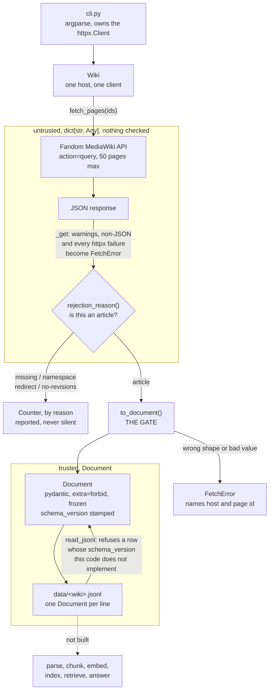

# Architecture

How ShonenChat works end to end. **Updated on the day the system changes, not weekly**,
and every number in it says how it was measured.

Started 2026-09-02, when the system was one fetcher. It is kept from that point
deliberately: the interesting part of this document later will be how much of it was
wrong at the start.

## What the system is for

A search and answer tool over 28 shonen anime and manga Fandom wikis, which cites the
source of every answer. The corpus and the audience are fixed by
[ADR 0001](decisions/0001-corpus-and-community.md) and neither changes again.

## The pipeline today

## The trust boundary, and why it is one line

`response.json()` is typed `Any`. `Any` means *stop checking*, and it is contagious: every
value derived from it is unchecked too. Until the model landed, that hole ran unbroken from the socket
to the file on disk, and a type checker would have reported nothing, because there was
nothing to report — mypy reads code, and never sees a byte of data.

**There are two entrances, not one, and an earlier version of this section named only the
first.** `to_document()` gates data arriving from the API. `read_jsonl()` gates data
arriving from disk, via `Document.model_validate`, because a file written by an older
version of this code is untrusted input exactly like a network response is. Both end the
same way. Above them a row is a `dict[str, Any]`; below them a `Document` exists or an
exception was raised, with no third outcome. The checks are in one
place rather than scattered as `if "content" in page` through the codebase.

**A filter and a gate are different jobs and this codebase keeps them apart.**
`rejection_reason()` answers *should this page be in the corpus* — the answer is a category
and the count is reported. `to_document()` answers *is this page the shape we require* —
the answer is a `Document` or a raised `FetchError`.

## What owns what

| Module | Owns | Deliberately does not |
|---|---|---|
| `cli.py` | Argument parsing, the `httpx.Client` lifetime, the run summary | Know anything about MediaWiki |
| `fetch.py` | One wiki, its API contract, the skip taxonomy, id walking, and reading rows back | Decide where files go, or what a document means |
| `models.py` | The shape of a `Document`, and every runtime guarantee about it | Touch the network, or know MediaWiki exists |

The `httpx.Client` is built in `cli.py` and passed into `Wiki`, not created inside it, so
one connection is reused across every batch and `Wiki` can be tested against a fake
transport with no network at all. That is what let the eight failure paths be proven from
the start, before the test suite existed.

## Two decisions worth recording

**Only `Document` is modelled, not the API page.** A `Page` model parsed inside `_get`
would mean nothing untyped ever leaves the client. It was rejected because the API page is
wide, mostly unused, and Fandom can add keys at will, so it doubles the model surface for
no extra guarantee at the point that matters, which is what lands on disk. It becomes the
right answer when a second source with a different page shape arrives, which is the
parse-routing problem for a later source.

**`Document` carries its own schema version, and the reader enforces it.** `SCHEMA_VERSION`
is stamped as the first key of every row rather than written once in a file header, so a
row stays self-describing after it leaves its file and two runs can still be joined with
`cat`. It is a field default and never a call-site argument, so no code path can stamp a
row with a version other than the one it implements. `read_jsonl` refuses any row it does
not implement, naming file and line, because a version written and never checked is
decoration. **A row with no `schema_version` key is read as version 1**: the 1,000 rows
already on disk predate the field, and adding an optional field is the one change that
leaves what an old row *means* untouched. That reasoning is correct for this bump and wrong
for every future one.

**This versions our model, not Fandom's API.** See the drift note below.

**Page ids are walked ascending, not enumerated.** MediaWiki assigns ids in creation order,
so ascending id is oldest first. Ids are not contiguous — deletion leaves permanent holes
and they are never reused — so the walk scans far wider than it keeps and reports
`examined` and `requested_to` as two separate numbers.

## Measured, 2026-09-02

One wiki, `onepiece.fandom.com`, walked from id 1 by
`shonenchat fetch --limit 1000 --scan-ceiling 25000`.

| | Value | Method |
|---|---|---|
| Documents kept | **1,000** | the run's own count, `data/onepiece.jsonl` line count |
| Page ids examined | 5,766 | ids 1 to 5,800 requested, run returned mid-batch |
| Skipped: missing | 3,333 (57.8%) | `rejection_reason`, `Counter` |
| Skipped: namespace | 723 (12.5%) | as above |
| Skipped: redirect | 710 (12.3%) | as above |
| Ids walked per article kept | 5.8 | 5,766 / 1,000 |
| First article's page id | **1,439** | min `page_id` in the output |
| Mean wikitext | 12,362 chars | sum / 1,000 |
| **Median wikitext** | **6,160 chars** | sorted, middle element |
| Longest / shortest | 122,962 / 332 | max, min |
| Duplicate page ids | 0 | `len(set(page_id)) == 1000` |
| Empty articles | 0 | count of zero-length `wikitext` |

The invariant `examined == len(documents) + sum(skipped.values())` holds:
1,000 + 4,766 = 5,766. It is not yet a test, only an observation.

**Two things this table says that a single number would hide.**

The first 1,750 ids needed 17.5 ids per article kept. Ids 1,751 to 5,766 needed 4.5, and
the `missing` share fell from 89% to 44%. Deletion is concentrated in the earliest block,
and no article at all exists below id 1,439. **An early sample of a wiki is unrepresentative
of every rate, not only of the one you noticed.**

The mean is 12,362 and the median is 6,160, with a maximum of 122,962. The distribution has
a heavy right tail, so the mean describes almost none of these documents. Any claim made
about document length from a mean alone is fragile and should carry the median beside it.

## What is not built

Everything after the `.jsonl` file. No parser, no chunker, no database, no embeddings, no
index, no retrieval, no API, no interface. `data/` is not committed.

Known and not fixed:

- **Nothing rejects an empty article.** A page with empty wikitext validates fine and
  becomes a worthless corpus entry. It is a `rejection_reason` question and it is open.
  Zero occurred in the run of 1,000, so it is an unguarded risk rather than an
  observed fault.
- **pydantic runs in lax mode**, so a `revid` arriving as the string `"99"` is silently
  converted to `99` rather than refused. `ConfigDict(strict=True)` is the switch. Left lax
  on purpose, recorded here so it is a decision and not an accident.
- **Upstream drift is unguarded, and an earlier version of this document implied
  otherwise.** `extra="forbid"` on `Document` cannot see a new Fandom key, because
  `to_document` plucks seven named fields by hand and the payload never passes through the
  constructor. If Fandom adds `lastrevid` tomorrow every fetch succeeds and nothing fires.
  The setting guards *our* mistakes, not theirs. Being liberal in what we accept is what
  stops a harmless key waking anyone at 3 a.m.; the cost is that a genuinely useful new key,
  an `is_deleted` flag say, arrives unnoticed. Revisit with an API-page model.
- **`fetch_oldest` claims to return the oldest `limit` articles by ascending page id, and
  it cannot guarantee that.** MediaWiki does not document any ordering guarantee for the
  `pages` array. The early return fires mid-batch, so the articles kept from the final batch
  are the first ones *in response order*, not the lowest ids in it. `sorted()` at the return
  orders the output and cannot change which documents were selected. The error is bounded by
  `BATCH_SIZE`, so at most 49 ids of slop at the boundary, and the claim in the docstring is
  unqualified. **Unmeasured:** whether Fandom in fact returns pages in requested order. One
  probe settles it and it has not been run.
- **Nothing checks that the API returned a page for every id requested.** `examined`
  increments per page *returned*, and no code asserts that equals the number of ids asked
  for. The invariant `examined == kept + sum(skipped)` proves the piles add up; it
  cannot see a short response. Whether Fandom can return fewer pages than requested ids is
  **unmeasured**, and that is the gap the earlier `scanned_to` bug lived in.
- **No tests yet.** `fetch_oldest` accepts a `client`, so every path above was proven
  against `httpx.MockTransport` with no network, but proven in a throwaway script rather
  than a suite that reruns.
